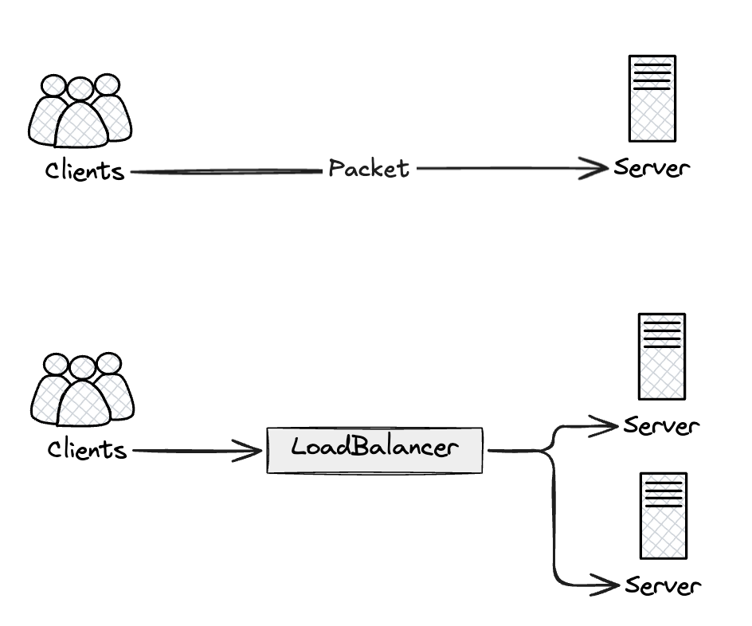
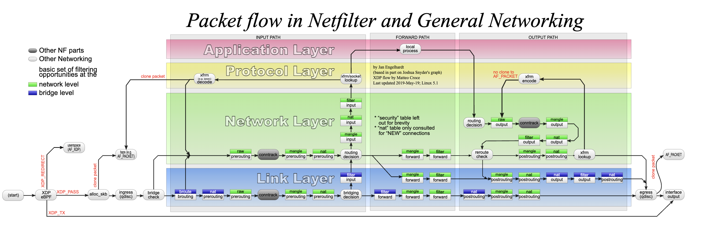
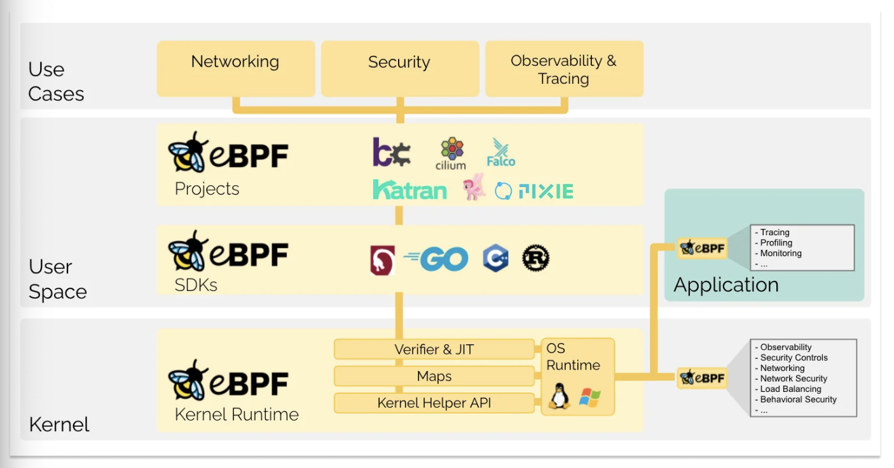
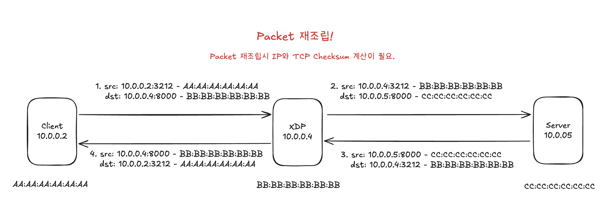

# ZERO COPY의 미학 #1 (XDP LoadBalancer편)

## 소개
매우 간단한 서버를 구축한다고 했을 때 아래와 같이 생각할 수 있다. 


분산시스템 이론을 제외한채 서버의 트래픽을 분리하기 위해서는 추가적인 서버를 필요로하고 클라이언트의 요청을 특정 서버로 포워딩 시키기 위해서는 앞단에 로드밸런서를 둘 수 있다. 로드밸런서를 뒀던 목적이 트래픽분리로 속도의 이점을 챙기려했지만 패킷이 이동하는 경로에 물리적인(또는 가상의) 네트워크 홉이 추가되었기에 이전 로드밸런서가 없던(베이스라인)시기보다 느리게된다.

일반적인 로드밸런서의 종류로는 유저스페이스 또는 커널스페이스에서 동작하는 구조로 나뉜다. 유저스페이스 로드밸런서의 경우 네트워크 인터페이스에서 패킷을 처리하고 커널스페이스로, 커널스페이스에서 유저스페이스로의 패킷 메모리 복사가 발생하여 속도측면에서 손실이 발생한다. 더군다나 서버가 아닌 패킷을 포워딩해야하는 로드밸런서 입장에서는 불필요한 오버헤드라고 볼 수 있다. 커널스페이스단에서 동작하는 로드밸런서의 경우 앞서 언급된 유저스페이스로의 메모리 카피등의 오버헤드는 줄일 수 있지만 네트워크스택(TCP/IP)을 거친다는 입장에서 그리고 핵심적인 NIC에서 수신한 패킷을 sk_buff 구조체를 할당하는 메모리 카피 부분이 발생한다.


[출처: https://en.wikipedia.org/wiki/Iptables]

앞서 말했듯이 이러한 부분은 포워딩하는 입장에서는 불필요한 오버헤드로 판단될 수 있다. 이번 글은 위의 문제점을 해결하는 리눅스 커널의 네트워크 TCP/IP 스택을 거치지 않고 sk_buff 구조체 할당을 진행하지 않는 zero copy를 할 수 있도록 도와주는 eBPF의 한종류인 XDP에 대해서 알아보고자 한다. 그리고 XDP LoadBalancer에 대해서 자세히 알아보고자 한다. 마지막으로는 실제 만든 XDP 로드밸런서 프로그램이 userspace에서 동작하는 로드밸런서와 비교했을 때 어느정도의 속도적 이점이 존재하는지 제시하고자 한다.

다만 이글은 리눅스 네트워크 스택이 어떤식으로 구성하는지는 다루지않는다. 다만 eBPF/XDP와 로드밸런서를 다루며 어떻게 패킷을 고속으로 처리할지 또 관련 디버깅 도구 소개가 주 목적이다. 

## eBPF?   
eBPF/XDP와 관련해서 설명하기전에 BPF라는 것이 무엇인지 간략하게 설명하는것부터 시작한다.

[출처: https://ebpf.io/what-is-ebpf/]  
> 본 내용은 XDP를 설명하기위한 과정이므로 eBPF Virtual Machine, Verifier의 동작은 설명하지 않으며 언급만하고 넘어간다.

eBPF는 BPF(Berkeley Packet Filter)의 약자이지만 extend BPF는 패킷필터 이상의 기능(관찰가능성, 트레이싱, ,,,)을 수행하기 때문에 이제는 어떤 의미도 없는 독릭적인 용어다. eBPF 프로그램은 이벤트 기반이며 커널이나 애플리케이션이 특정 훅 지점을 통과할 때 실행된다. 후크의 종류로는 syscall, kernel or user tracing, network event, function entry/exit가 존재한다. 이러한 eBPF 프로그램은 커널스페이스에서 동작하기 때문에 엄격한 Verifier(검증기)를 통해 동작에 이상이 없음을 확인하고 JIT Compiler로부터 동작된다. 엄격한 검증기때문에 몇몇 함수 사용이 제한되기 때문에 eBPF는 특수한 형태의 커널 헬퍼 함수를 사용할 수 있다. 
> 엄격한 검사의 예로는 패킷 포인터 접근시 경계를 넘어갈 가능성이 있는지등이 존재한다.

즉, eBPF는 크게 BPF MAP, Virtual Machine, Verifier 3가지의 구성요소가 존재한다.

## XDP(eXpress Data Path)
XDP(eXpress Data Path)는 프로그래밍 가능한 패킷 처리 기술이다. 이전에 존재한 DPDK는 커널을 우회했기 때문에 보안과 안정성은 보장할 수 없었다. XDP 프로그램은 앞서 말한것과 같이 eBPF 프로그램은 검증기와 JIT을 통해 커널공간에서 안전하게 실행된다. 또한, XDP는 리눅스 커널의 일부분으로 구현되어 있어 리눅스 네트워크 스택과 완전히 통합된다. 그렇기에 프로그래머는 커널과 사용자 공간사이의 컨텍스트 전환없이 장치 드라이버(NIC)에서 직접 코드 실행이 가능하기에 하드웨어에서 패킷 수신 직후 해당 패킷의 처리를 결정 또는 조작등 여러가지 구현이 가능하다.

만든 XDP 프로그램의 반환값으로 Action이라는 정수 반환값을 필요로 하며 지원가능한 값은 다음과 같다. `XDP_DROP`, `XDP_PASS`, `XDP_REDIRECT`, `XDP_TX`

- `XDP_ABORTED`: 패킷을 DROP함과 동시에 예외를 추가로 일으킨다.
- `XDP_DROP` : 패킷을 DROP한다.  
- `XDP_PASS` : 패킷을 다음 처리기로 이동을 허용한다.
- `XDP_REDIRECT` : 도착한 패킷을 다른 NIC로 전달하거나, 추가처리를 위한 다른 CPU로 전달허간, 사용자 공간으로 전달한다.
- `XDP_TX` : 패킷을 수신했던 NIC로 다시 주입한다. 
> XDP_REDIRECT의 경우 나머지 3개의 Action과 달리 bpf helper함수를 필요로한다.

XDP가 무엇인지는 대략적으로 감을 잡았더라도 어디서 어떻게 동작하는지 와닫지 않았을것이다. 실제로 XDP Program이 어떠한 과정으로 실행되는지 짧게 살펴본다. 사용되는 시스템은 실제 호스트가 아닌 가상머신과 가상이더넷을 기반으로 진행예정이므로 리눅스 커널의 virtio와 veth를 중심으로 살펴본다. 그리고 실제 XDP프로그램이 veth에 attach 예정인데 veth에 XDP 프로그램이 붙었는가에 따라 동작이 상이해진다. 이러한 부분 또한 집중적으로 살펴보겠다. 그리고 XDP는 Native와 Generic 모드가 존재하는데 Generic 모드는 간단하게 살펴보고 실제 구현과 동작은 Native 모드를 기준으로 진행한다.

### XDP INSTALL & ATTACH
> 본 소스코드는 Linux Kernel의 v6.11과 v6.17을 기준으로 합니다.
```C
/* drivers/net/veth.c */
static const struct net_device_ops veth_netdev_ops = {
	.ndo_init           = veth_dev_init,
	.ndo_start_xmit     = veth_xmit,
	.ndo_bpf		    = veth_xdp,
	.ndo_xdp_xmit		= veth_ndo_xdp_xmit,
	.ndo_get_peer_dev	= veth_peer_dev,
};

/* drivers/net/virtio_net.c */
static const struct net_device_ops virtnet_netdev = {
	.ndo_open            = virtnet_open,
	.ndo_stop   	     = virtnet_close,
	.ndo_start_xmit      = start_xmit,
	.ndo_bpf		     = virtnet_xdp,
};

/* net/core/dev.c */
static int dev_xdp_attach(struct net_device *dev, struct netlink_ext_ack *extack,
			  struct bpf_xdp_link *link, struct bpf_prog *new_prog,
			  struct bpf_prog *old_prog, u32 flags)
{
    enum bpf_xdp_mode mode;
    [...]
    /* Generic or Native */
    mode = dev_xdp_mode(dev, flags);
    [...]
    /* get xdp installation function */
    bpf_op = dev_xdp_bpf_op(dev, mode);
    [...]
    /* install xdp hook */
    err = dev_xdp_install(dev, mode, bpf_op, extack, flags, new_prog);
}

/* net/core/dev.c */
static bpf_op_t dev_xdp_bpf_op(struct net_device *dev, enum bpf_xdp_mode mode)
{
	switch (mode) {
	case XDP_MODE_SKB:
		return generic_xdp_install;
	case XDP_MODE_DRV:
	case XDP_MODE_HW:
		return dev->netdev_ops->ndo_bpf;
	default:
		return NULL;
	}
}
```
XDP 프로그램을 설치하게되면 `dev_xdp_attach` 함수를 호출하여 xdp를 붙일 때 `dev_xdp_mode`함수를 통해 XDP 동작 모드를 Generic 또는 Native중 하나 선택한다. `dev_xdp_install`함수 내에서 `Generic`의 경우 `generic_xdp_install`함수를 호출하여 generic_xdp_needed_key 값을 세팅한다. `Generic`의 경우 해당 값이 세팅되면 `__netif_receive_skb_core` -> `do_xdp_generic` 함수를 호출하여 XDP 프로그램을 실행한다. 함수에서 볼 수 있듯이 `sk_buff` 할당 이후에 실행되기에 일반적으로 알려진 `sk_buff`할당 이전에 실행되는 `Native` 모드와 차이가 있으며 성능 또한 떨어진다. 다만 모든 드라이버에 지원이 가능하며 테스트환경으로 진행은 가능하다.  

그 외의 경우 `ndo_bpf`에 연결된 함수 포인터를 호출하게 된다. `virtio_net`의 경우 `virtnet_xdp`, `veth`의 경우 `veth_xdp` 함수 이다. 실제 로드밸런서 구현에서 XDP 프로그램이 실행되는 곳은 `veth`이므로 해당 구간을 살펴본다. [`NAPI`](https://docs.kernel.org/networking/napi.html)의 경우 해당 링크를 참고하기를 바란다.

```C
/* drivers/net/veth.c */
static int veth_enable_xdp_range(struct net_device *dev, int start, int end,
				 bool napi_already_on)
{
[...]
    if (!napi_already_on)
        netif_napi_add(dev, &rq->xdp_napi, veth_poll);
[...]
	return err;
}
```
`veth_xdp`함수를 시작으로 타고 들어가면 `veth_enable_xdp_range`라는 함수를 확인할 수 있다. 해당 구간을 통해 napi의 poll함수 포인터에 `veth_poll`함수를 등록한다. NAPI를 활성화하고 polling함수로 `veth_poll`을 사용함을 의미한다. `NAPI`에대한 글이아닌 XDP 설치 및 실행에 관한것이기에 자세한것은 넘어간다.

#### 번외) veth가 Native XDP를 지원하나요?
2018년 커널 패치중 veth에 generic이 아닌 native XDP를 지원하는 패치가 등장했다. 관련된 내용은 아래 패치를 참고하기를 바란다.  [Merge branch 'bpf-veth-xdp-support'](https://git.kernel.org/pub/scm/linux/kernel/git/torvalds/linux.git/commit/?id=60afdf066a35317efd5d1d7ae7c7f4ef2b32601f)


### XDP EXECUTION

```C
static int veth_forward_skb(struct net_device *dev, struct sk_buff *skb,
			    struct veth_rq *rq, bool xdp)
{
	return __dev_forward_skb(dev, skb) ?: xdp ?
		veth_xdp_rx(rq, skb) :
		__netif_rx(skb);
}
```


```bash
 virtnet_xdp_handler+0
        receive_small+616
        receive_buf+264
        virtnet_receive.constprop.0+724
        virtnet_poll+104
        __napi_poll+72
```

```bash
veth_xdp_rcv_skb+0
        veth_poll+152
        __napi_poll+72
        net_rx_action+488
        handle_softirqs+312
```

### 로드밸런서
지금까지 XDP에 대해서 간략하게 알아보았다. 다음은 이 글의 목적인 XDP 로드밸런서를 구현하고 이를 테스트하는 시간을 가진다. XDP로드밸런서를 구현하기 위해서는 2가지의 방식이 존재한다. 

#### NAT 로드밸런서 (Masquerading)
가장 구현난이도가 낮은 방식이나 성능적인 측면에서 다음에 나올 Direct Server Return 방식보다는 좋지못하다. 

위는 NAT방식의 XDP 로드밸런서를 구현할 때 기본적인 구조이다. XDP는 NIC에서 패킷 수신 후 리눅스 네트워크 스택을 태우기전에 실행되는 구간이므로 ehternet frame과 ip, tcp header 및 option 처리가 필요하다. XDP 프로그램에서 트리거된 패킷을 살펴보면 목적지가 로드밸런서쪽으로 되어 있기 때문에 해당 값을 원하는 서버 목적지 정보 입력이 필요하다. 또한 패킷의 IP Header와 TCP Header 정보가 수정되었기 떄문에 각 각 Checksum 재계산이 필요하다. 

#### DSR 로드밸런서
> DSR은 Direct Server Return의 약어이다.

### 테스트 및 퍼포먼스

### 참고문헌
- https://www.cs.cornell.edu/~ragarwal/pubs/network-stack.pdf
- https://d2.naver.com/helloworld/47667
- The eXpress data path: fast programmable packet processing in the operating system kernel


### 메모장
napi_schedule() , sofrirq handler net_rx_action -> poll() 
netif_receive_skb()
-> NIC가 인터럽트한 특정 CPU를 CPU0라고 할때 CPU0는 처음부터 끝까지 패킷 처리 담당

XDP hook은 napi전이라서 CPU안쓰는듯

generic, native,

NAPI poll전인가? XDP HOOK이 트리거되는 시점이 정확히 어디인자 확인해야 할드


sudo bpftrace -e '
kprobe:netif_receive_skb {
    $skb = (struct sk_buff *)arg0;
    $dev = $skb->dev;
    printf("ifname=%s pid=%d\n", $dev->name, pid);
    print(kstack);
}'